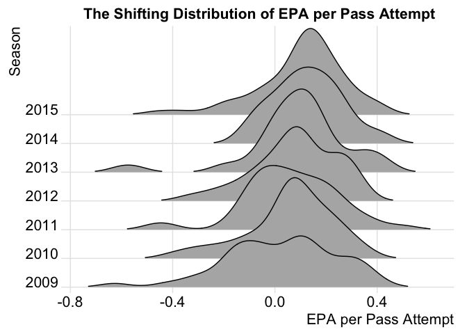

<!-- README.md is generated from README.Rmd. Please edit that file -->
Introducing the nflscrapR Package
=================================

This package was built to allow R users to utilize and analyze data from the National Football League (NFL) API. The functions in this package allow users to perform analysis at the play and game levels on single games and entire seasons. By parsing the play-by-play data recorded by the NFL, this package allows NFL data enthusiasts to examine each facet of the game at a more insightful level. The creation of this package puts granular data into the hands of the any R user with an interest in performing analysis and digging up insights about the game of American Football. With open-source data, the development of reproducible advanced NFL metrics can occur at a more rapid pace and lead to growing the football analytics community.

*Note: Data is only available after 2009*

Downloading and Loading the Package
===================================

``` r
# Must install the devtools package using the below commented out code
# install.packages('devtools')
library(devtools)

devtools::install_github(repo = "maksimhorowitz/nflscrapR")
#> Skipping install for github remote, the SHA1 (05815ef8) has not changed since last install.
#>   Use `force = TRUE` to force installation

# Load the package

library(nflscrapR)
```

Simple Example of Package Usage
===============================

Here is an example of comparing the difference in the distributions of EPA per attempt for passers with at least 50 attempts between NFL seasons from 2009-2016. The code for this example is below:

``` r
# Loading the data with season_play_by_play function: (Note the
# season_play_by_play function takes a few minutes to run)

pbp_2009 <- season_play_by_play(2009)
pbp_2010 <- season_play_by_play(2010)
pbp_2011 <- season_play_by_play(2011)
pbp_2012 <- season_play_by_play(2012)
pbp_2013 <- season_play_by_play(2013)
pbp_2014 <- season_play_by_play(2014)
pbp_2015 <- season_play_by_play(2015)
pbp_2016 <- season_play_by_play(2016)

# Stack the datasets together: (Load the tidyverse first - as if you didn't
# already...)

library(tidyverse)
#> Loading tidyverse: tibble
#> Loading tidyverse: tidyr
#> Loading tidyverse: readr
#> Loading tidyverse: purrr
#> Loading tidyverse: dplyr
#> Conflicts with tidy packages ----------------------------------------------
#> complete(): tidyr, RCurl
#> filter():   dplyr, stats
#> lag():      dplyr, stats

pbp_data <- bind_rows(pbp_2009, pbp_2010, pbp_2011, pbp_2012, pbp_2013, pbp_2014, 
    pbp_2015, pbp_2015)

# Now filter down to only passing attempts, group by the season and passer,
# then calculate the number of passing attempts, total expected points added
# (EPA), EPA per attempt, then finally filter to only those with at least 50
# pass attempts:

passing_stats <- pbp_data %>% filter(PassAttempt == 1 & PlayType != "No Play" & 
    !is.na(Passer)) %>% group_by(Season, Passer) %>% summarise(Attempts = n(), 
    Total_EPA = sum(EPA, na.rm = TRUE), EPA_per_Att = Total_EPA/Attempts) %>% 
    filter(Attempts >= 50)

# Using the ggjoy package (install with the commented out code below) can
# compare the EPA per Pass Attempt for each NFL season:
library(ggplot2)
# install.packages('ggjoy')
library(ggjoy)

ggplot(passing_stats, aes(x = EPA_per_Att, y = as.factor(Season))) + geom_joy(scale = 3, 
    rel_min_height = 0.01) + theme_joy() + ylab("Season") + xlab("EPA per Pass Attempt") + 
    scale_y_discrete(expand = c(0.01, 0)) + scale_x_continuous(expand = c(0.01, 
    0)) + ggtitle("The Shifting Distribution of EPA per Pass Attempt") + theme(plot.title = element_text(hjust = 0.5, 
    size = 16), axis.title = element_text(size = 16), axis.text = element_text(size = 16))
#> Picking joint bandwidth of 0.0603
```


